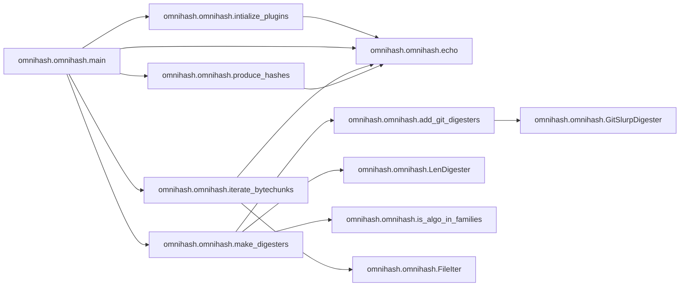
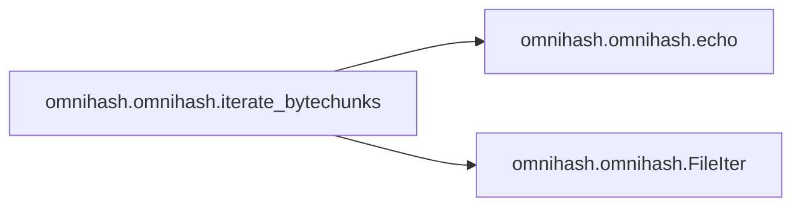
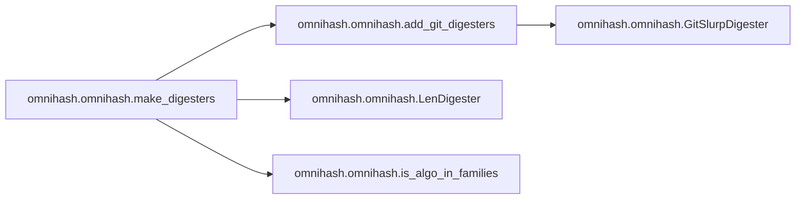

# Omnihash Omnihash

[_Documentation generated by Documatic_](https://www.documatic.com)

<!---Documatic-section-Codebase Structure-start--->
## Codebase Structure

<!---Documatic-block-system_architecture-start--->
```mermaid
None
```
<!---Documatic-block-system_architecture-end--->

# #
<!---Documatic-section-Codebase Structure-end--->

<!---Documatic-section-omnihash.omnihash.intialize_plugins-start--->
## [omnihash.omnihash.intialize_plugins](3-omnihash_omnihash.md#omnihash.omnihash.intialize_plugins)

<!---Documatic-section-intialize_plugins-start--->


### Object Calls

* [omnihash.omnihash.echo](3-omnihash_omnihash.md#omnihash.omnihash.echo)

<!---Documatic-block-omnihash.omnihash.intialize_plugins-start--->
<details>
	<summary><code>omnihash.omnihash.intialize_plugins</code> code snippet</summary>

```python
def intialize_plugins(plugin_group_name=PLUGIN_GROUP_NAME):
    entry_points = pkg_resources.working_set.iter_entry_points(plugin_group_name)
    for ep in sorted(entry_points, key=lambda ep: ep.name):
        try:
            plugin_loader = ep.load()
            if callable(plugin_loader):
                plugin_loader()
        except Exception as ex:
            click.echo('Failed LOADING plugin(%r@%s) due to: %s' % (ep, ep.dist, ex), err=1)
```
</details>
<!---Documatic-block-omnihash.omnihash.intialize_plugins-end--->
<!---Documatic-section-intialize_plugins-end--->

# #
<!---Documatic-section-omnihash.omnihash.intialize_plugins-end--->

<!---Documatic-section-omnihash.omnihash.plugin_sha3_digesters-start--->
## [omnihash.omnihash.plugin_sha3_digesters](3-omnihash_omnihash.md#omnihash.omnihash.plugin_sha3_digesters)

<!---Documatic-section-plugin_sha3_digesters-start--->
<!---Documatic-block-omnihash.omnihash.plugin_sha3_digesters-start--->
<details>
	<summary><code>omnihash.omnihash.plugin_sha3_digesters</code> code snippet</summary>

```python
def plugin_sha3_digesters():
    import sha3
    known_digesters['SHA3_224'] = (sha3.SHA3224(), lambda d: d.hexdigest().decode('utf-8'))
    known_digesters['SHA3_256'] = (sha3.SHA3256(), lambda d: d.hexdigest().decode('utf-8'))
    known_digesters['SHA3_384'] = (sha3.SHA3384(), lambda d: d.hexdigest().decode('utf-8'))
    known_digesters['SHA3_512'] = (sha3.SHA3512(), lambda d: d.hexdigest().decode('utf-8'))
```
</details>
<!---Documatic-block-omnihash.omnihash.plugin_sha3_digesters-end--->
<!---Documatic-section-plugin_sha3_digesters-end--->

# #
<!---Documatic-section-omnihash.omnihash.plugin_sha3_digesters-end--->

<!---Documatic-section-omnihash.omnihash.plugin_pyblake2_digesters-start--->
## [omnihash.omnihash.plugin_pyblake2_digesters](3-omnihash_omnihash.md#omnihash.omnihash.plugin_pyblake2_digesters)

<!---Documatic-section-plugin_pyblake2_digesters-start--->
<!---Documatic-block-omnihash.omnihash.plugin_pyblake2_digesters-start--->
<details>
	<summary><code>omnihash.omnihash.plugin_pyblake2_digesters</code> code snippet</summary>

```python
def plugin_pyblake2_digesters():
    import pyblake2
    known_digesters['BLAKE2s'] = (pyblake2.blake2s(), lambda d: d.hexdigest())
    known_digesters['BLAKE2b'] = (pyblake2.blake2b(), lambda d: d.hexdigest())
```
</details>
<!---Documatic-block-omnihash.omnihash.plugin_pyblake2_digesters-end--->
<!---Documatic-section-plugin_pyblake2_digesters-end--->

# #
<!---Documatic-section-omnihash.omnihash.plugin_pyblake2_digesters-end--->

<!---Documatic-section-omnihash.omnihash.add_git_digesters-start--->
## [omnihash.omnihash.add_git_digesters](3-omnihash_omnihash.md#omnihash.omnihash.add_git_digesters)

<!---Documatic-section-add_git_digesters-start--->


### Object Calls

* omnihash.omnihash.GitSlurpDigester

<!---Documatic-block-omnihash.omnihash.add_git_digesters-start--->
<details>
	<summary><code>omnihash.omnihash.add_git_digesters</code> code snippet</summary>

```python
def add_git_digesters(digesters, fpath):
    try:
        fsize = os.stat(fpath).st_size
        digesters['GIT-BLOB'] = (hashlib.sha1(b'blob %i\x00' % fsize), lambda d: d.hexdigest())
        digesters['GIT-COMMIT'] = (hashlib.sha1(b'commit %i\x00' % fsize), lambda d: d.hexdigest())
        digesters['GIT-TAG'] = (hashlib.sha1(b'tag %i\x00' % fsize), lambda d: d.hexdigest())
    except:
        digesters['GIT-BLOB'] = (GitSlurpDigester('blob'), lambda d: d.digest())
        digesters['GIT-COMMIT'] = (GitSlurpDigester('commit'), lambda d: d.digest())
        digesters['GIT-TAG'] = (GitSlurpDigester('tag'), lambda d: d.digest())
```
</details>
<!---Documatic-block-omnihash.omnihash.add_git_digesters-end--->
<!---Documatic-section-add_git_digesters-end--->

# #
<!---Documatic-section-omnihash.omnihash.add_git_digesters-end--->

<!---Documatic-section-omnihash.omnihash.main-start--->
## [omnihash.omnihash.main](3-omnihash_omnihash.md#omnihash.omnihash.main)

<!---Documatic-section-main-start--->


### Object Calls

* [omnihash.omnihash.intialize_plugins](3-omnihash_omnihash.md#omnihash.omnihash.intialize_plugins)
* [omnihash.omnihash.echo](3-omnihash_omnihash.md#omnihash.omnihash.echo)
* [omnihash.omnihash.make_digesters](3-omnihash_omnihash.md#omnihash.omnihash.make_digesters)
* [omnihash.omnihash.iterate_bytechunks](3-omnihash_omnihash.md#omnihash.omnihash.iterate_bytechunks)
* [omnihash.omnihash.produce_hashes](3-omnihash_omnihash.md#omnihash.omnihash.produce_hashes)

<!---Documatic-block-omnihash.omnihash.main-start--->
<details>
	<summary><code>omnihash.omnihash.main</code> code snippet</summary>

```python
@click.command()
@click.argument('hashmes', nargs=-1)
@click.option('-s', is_flag=True, default=False, help='Hash input as string, even if there is a file with that name.')
@click.option('-v', is_flag=True, default=False, help='Show version and quit.')
@click.option('-c', is_flag=True, default=False, help='Calculate CRCs as well.')
@click.option('-f', is_flag=False, default=False, multiple=True, help='Select one or more family of algorithms: include only algos having TEXT (ci) in their names.')
@click.option('-m', is_flag=False, default=False, help='Match input string.')
@click.option('-j', is_flag=True, default=False, help='Output result in JSON format.')
@click.pass_context
def main(click_context, hashmes, s, v, c, f, m, j):
    if v:
        version = pkg_resources.require('omnihash')[0].version
        click.echo(version)
        return
    intialize_plugins()
    results = []
    if not hashmes:
        if not sys.stdin.isatty():
            digesters = make_digesters(None, f, c)
            stdin = click.get_binary_stream('stdin')
            bytechunks = iter(lambda : stdin.read(io.DEFAULT_BUFFER_SIZE), b'')
            if not j:
                click.echo('Hashing ' + click.style('standard input', bold=True) + '..', err=True)
            results.append([produce_hashes(bytechunks, digesters, match=m, use_json=j)])
        else:
            print(click_context.get_help())
            return
    else:
        hash_many = len(hashmes) > 1
        for hashme in hashmes:
            result = {}
            digesters = make_digesters(hashme, f, c)
            bytechunks = iterate_bytechunks(hashme, s, j, hash_many)
            if bytechunks:
                result = produce_hashes(bytechunks, digesters, match=m, use_json=j)
            if result:
                result['NAME'] = hashme
                results.append(result)
    if results and j:
        print(json.dumps(results, indent=4, sort_keys=True))
```
</details>
<!---Documatic-block-omnihash.omnihash.main-end--->
<!---Documatic-section-main-end--->

# #
<!---Documatic-section-omnihash.omnihash.main-end--->

<!---Documatic-section-omnihash.omnihash.iterate_bytechunks-start--->
## [omnihash.omnihash.iterate_bytechunks](3-omnihash_omnihash.md#omnihash.omnihash.iterate_bytechunks)

<!---Documatic-section-iterate_bytechunks-start--->


### Object Calls

* [omnihash.omnihash.echo](3-omnihash_omnihash.md#omnihash.omnihash.echo)
* omnihash.omnihash.FileIter

<!---Documatic-block-omnihash.omnihash.iterate_bytechunks-start--->
<details>
	<summary><code>omnihash.omnihash.iterate_bytechunks</code> code snippet</summary>

```python
def iterate_bytechunks(hashme, is_string, use_json, hash_many):
    if not is_string and validators.url(hashme):
        if not use_json:
            click.echo('Hashing content of URL ' + click.style(hashme, bold=True) + '..', err=not hash_many)
        try:
            response = requests.get(hashme)
        except requests.exceptions.ConnectionError as e:
            raise ValueError('Not a valid URL. :(')
        except Exception as e:
            raise ValueError('Not a valid URL. {}.'.format(e))
        if response.status_code != 200:
            click.echo('Response returned %s. :(' % response.status_code, err=True)
        bytechunks = response.iter_content()
    elif os.path.exists(hashme) and (not is_string):
        if os.path.isdir(hashme):
            if not use_json:
                click.echo(click.style('Skipping', fg='yellow') + ' directory ' + "'" + hashme + "'..", err=True)
            return None
        if not use_json:
            click.echo('Hashing file ' + click.style(hashme, bold=True) + '..', err=not hash_many)
        bytechunks = FileIter(open(hashme, mode='rb'))
    else:
        if not use_json:
            click.echo('Hashing string ' + click.style(hashme, bold=True) + '..', err=not hash_many)
        bytechunks = (hashme.encode('utf-8'),)
    return bytechunks
```
</details>
<!---Documatic-block-omnihash.omnihash.iterate_bytechunks-end--->
<!---Documatic-section-iterate_bytechunks-end--->

# #
<!---Documatic-section-omnihash.omnihash.iterate_bytechunks-end--->

<!---Documatic-section-omnihash.omnihash.make_digesters-start--->
## [omnihash.omnihash.make_digesters](3-omnihash_omnihash.md#omnihash.omnihash.make_digesters)

<!---Documatic-section-make_digesters-start--->


### Object Calls

* [omnihash.omnihash.add_git_digesters](3-omnihash_omnihash.md#omnihash.omnihash.add_git_digesters)
* omnihash.omnihash.LenDigester
* [omnihash.omnihash.is_algo_in_families](3-omnihash_omnihash.md#omnihash.omnihash.is_algo_in_families)

<!---Documatic-block-omnihash.omnihash.make_digesters-start--->
<details>
	<summary><code>omnihash.omnihash.make_digesters</code> code snippet</summary>

```python
def make_digesters(fpath, families, include_CRCs=False):
    families = set((f.upper() for f in families))
    digesters = OrderedDict()
    digesters['LENGTH'] = (LenDigester(), LenDigester.digest)
    for algo in sorted(hashlib.algorithms_available):
        aname = algo.upper()
        if aname not in digesters and is_algo_in_families(aname, families):
            digesters[aname] = (hashlib.new(algo), lambda d: d.hexdigest())
    if include_CRCs:
        for name in sorted(crcmod._crc_definitions_by_name):
            crc_name = crcmod._crc_definitions_by_name[name]['name']
            aname = crc_name.upper()
            if is_algo_in_families(aname, families):
                digesters[aname] = (crcmod.PredefinedCrc(crc_name), lambda d: hex(d.crcValue))
    add_git_digesters(digesters, fpath)
    digesters.update(known_digesters)
    for digester in list(digesters.keys()):
        if not is_algo_in_families(digester.upper(), families):
            digesters.pop(digester, None)
    return digesters
```
</details>
<!---Documatic-block-omnihash.omnihash.make_digesters-end--->
<!---Documatic-section-make_digesters-end--->

# #
<!---Documatic-section-omnihash.omnihash.make_digesters-end--->

<!---Documatic-section-omnihash.omnihash.produce_hashes-start--->
## [omnihash.omnihash.produce_hashes](3-omnihash_omnihash.md#omnihash.omnihash.produce_hashes)

<!---Documatic-section-produce_hashes-start--->


### Object Calls

* [omnihash.omnihash.echo](3-omnihash_omnihash.md#omnihash.omnihash.echo)

<!---Documatic-block-omnihash.omnihash.produce_hashes-start--->
<details>
	<summary><code>omnihash.omnihash.produce_hashes</code> code snippet</summary>

```python
def produce_hashes(bytechunks, digesters, match, use_json=False):
    streams = itt.tee(bytechunks, len(digesters))
    batch = zip(streams, digesters.items())
    results = {}
    match_found = False
    for (stream, (algo, (digester, hashfunc))) in batch:
        for b in stream:
            digester.update(b)
        result = hashfunc(digester)
        if match:
            if match in result:
                echo(algo, result, use_json)
                results[algo] = result
                match_found = True
        else:
            results[algo] = result
            echo(algo, result, use_json)
    if match:
        if not match_found:
            if not use_json:
                click.echo(click.style('No matches', fg='red') + ' found!', err=True)
    return results
```
</details>
<!---Documatic-block-omnihash.omnihash.produce_hashes-end--->
<!---Documatic-section-produce_hashes-end--->

# #
<!---Documatic-section-omnihash.omnihash.produce_hashes-end--->

<!---Documatic-section-omnihash.omnihash.is_algo_in_families-start--->
## [omnihash.omnihash.is_algo_in_families](3-omnihash_omnihash.md#omnihash.omnihash.is_algo_in_families)

<!---Documatic-section-is_algo_in_families-start--->
<!---Documatic-block-omnihash.omnihash.is_algo_in_families-start--->
<details>
	<summary><code>omnihash.omnihash.is_algo_in_families</code> code snippet</summary>

```python
def is_algo_in_families(algo_name, families):
    return not families or any((f in algo_name for f in families))
```
</details>
<!---Documatic-block-omnihash.omnihash.is_algo_in_families-end--->
<!---Documatic-section-is_algo_in_families-end--->

# #
<!---Documatic-section-omnihash.omnihash.is_algo_in_families-end--->

<!---Documatic-section-omnihash.omnihash.echo-start--->
## [omnihash.omnihash.echo](3-omnihash_omnihash.md#omnihash.omnihash.echo)

<!---Documatic-section-echo-start--->
<!---Documatic-block-omnihash.omnihash.echo-start--->
<details>
	<summary><code>omnihash.omnihash.echo</code> code snippet</summary>

```python
def echo(algo, digest, json=False):
    if not json:
        click.echo('  %-*s%s' % (32, click.style(algo, fg='green') + ':', digest))
```
</details>
<!---Documatic-block-omnihash.omnihash.echo-end--->
<!---Documatic-section-echo-end--->

# #
<!---Documatic-section-omnihash.omnihash.echo-end--->

[_Documentation generated by Documatic_](https://www.documatic.com)